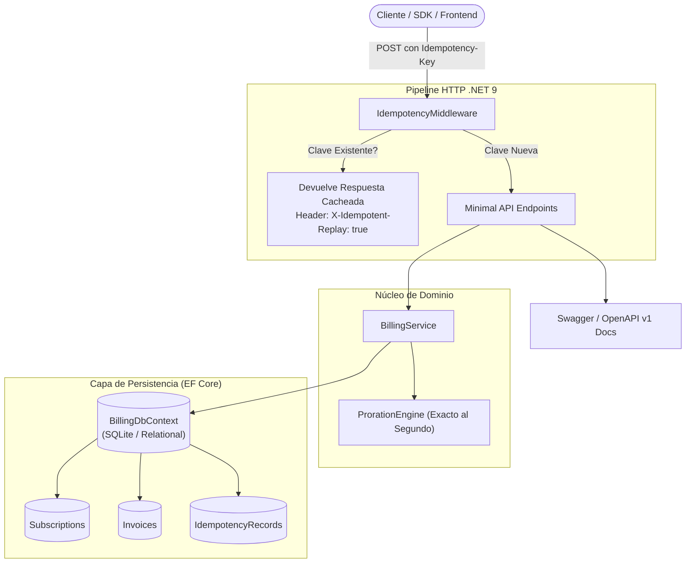
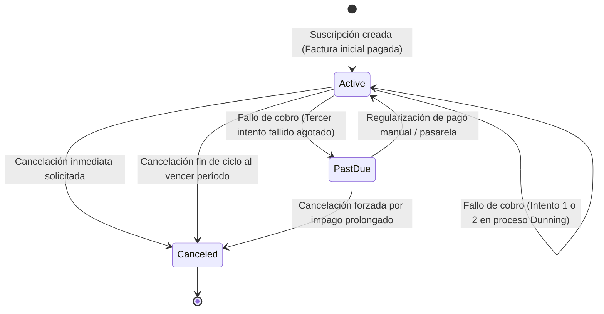

# Subscription Billing & Proration Engine (.NET 9 / C#)

[](https://github.com/jimmyrom1/subscription-billing-dotnet/actions/workflows/ci.yml)


Motor de facturación recurrente para SaaS enterprise desarrollado en **.NET 9 (C#)** con **Minimal APIs** y **Entity Framework Core**. Resuelve los tres mayores problemas críticos de la infraestructura de pagos corporativa: **prorrateo exacto al segundo** en cambios de plan a mitad de ciclo con redondeo bancario en céntimos enteros, **máquina de estados de dunning** con tolerancia a fallos transitorios de pago y degradación a `PastDue`, y **control estricto de idempotencia** (`Idempotency-Key`) con replay en caché y cabeceras de trazabilidad HTTP.

---

## El Problema Real en FinTech & SaaS

En plataformas de suscripción reales, delegar la facturación a lógica ingenua o tipos de coma flotante (`float`, `double`) provoca discrepancias contables acumulativas, disputas de clientes y pérdidas financieras:
1. **Pérdida de céntimos por coma flotante:** Realizar `price * (days_left / 30.0)` con tipos IEEE-754 introduce errores de truncamiento decimal. Los cálculos deben ejecutarse sobre enteros de subunidad mínima (céntimos en `long` o `decimal` con `MidpointRounding.AwayFromZero`).
2. **Cambios de plan a mitad de ciclo (Upgrades & Downgrades):** Cuando una empresa con 100 licencias pasa de Starter (15 €) a Pro (49 €) el día 18 del mes, el sistema debe acreditar exactamente el tiempo no disfrutado del plan actual y adeudar la fracción exacta del nuevo plan en una factura de compensación inmediata.
3. **Cobros duplicados por reintentos de red:** Si una pasarela de pago o cliente móvil sufre un timeout transitorio y reenvía la petición `POST /api/subscriptions`, un backend sin idempotencia creará dos contratos y cobrará dos veces.
4. **Ciclo de Reintentos de Cobro (Dunning Management):** Ante un fallo de tarjeta, no se debe cancelar inmediatamente al usuario ni dejar el servicio en un limbo: se aplica una ventana de reintentos con registro auditable y paso determinista a `PastDue` tras 3 intentos infructuosos.

---

## Arquitectura del Sistema



---

## Máquina de Estados de Suscripciones & Dunning



---

## Motor de Prorrateo Matemático

Cuando un suscriptor solicita un cambio de plan en el instante $t_{\text{effective}}$, habiendo iniciado el período en $t_{\text{start}}$ y finalizando en $t_{\text{end}}$:

1. **Fracción de tiempo restante:**
   $$\text{fraction} = \frac{t_{\text{end}} - t_{\text{effective}}}{t_{\text{end}} - t_{\text{start}}} \quad (0 \le \text{fraction} \le 1)$$

2. **Crédito no consumido del plan anterior:**
   $$\text{UnusedCredit} = \left\lfloor \text{Price}_{\text{current}} \times \text{fraction} + 0.5 \right\rfloor$$

3. **Cargo proporcional del nuevo plan:**
   $$\text{NewPlanCharge} = \left\lfloor \text{Price}_{\text{new}} \times \text{fraction} + 0.5 \right\rfloor$$

4. **Importe neto a liquidar:**
   $$\text{NetAmountDue} = \text{NewPlanCharge} - \text{UnusedCredit}$$
   - Si $\text{NetAmountDue} > 0$: Se factura y cobra inmediatamente la diferencia neta.
   - Si $\text{NetAmountDue} < 0$: Se genera un saldo acreedor a favor del cliente para las próximas renovaciones.

---

## Endpoints de la API

| Método | Ruta | Descripción | Cabeceras Relevantes |
|---|---|---|---|
| `GET` | `/healthz` | Comprobación de estado y liveness del microservicio | - |
| `GET` | `/swagger` | Documentación interactiva Swagger UI | - |
| `GET` | `/api/plans` | Catálogo de planes disponibles (Starter, Pro, Enterprise) | - |
| `POST` | `/api/subscriptions` | Da de alta una suscripción y genera la factura inicial | `Idempotency-Key` (Opcional) |
| `GET` | `/api/subscriptions/{id}` | Consulta el estado, plan actual y facturas asociadas | - |
| `POST` | `/api/subscriptions/{id}/change-plan` | Ejecuta un upgrade/downgrade con prorrateo y factura | `Idempotency-Key` (Opcional) |
| `POST` | `/api/subscriptions/{id}/cancel` | Cancela la suscripción (`immediate=true` o al fin de período) | - |
| `GET` | `/api/invoices` | Histórico de facturas filtrable por `subscriptionId` o `customerId` | - |
| `POST` | `/api/billing/process-due` | Procesa renovaciones vencidas y gestiona ciclo de dunning | - |
| `POST` | `/api/proration/preview` | Simulador estático sin estado para previsualizar prorrateos | - |

---

## Verificación de Idempotencia HTTP

Cualquier petición `POST` que incluya la cabecera `Idempotency-Key: <clave_unica>` se almacena en base de datos junto con su código de estado y cuerpo de respuesta. Reintentos subsiguientes no ejecutarán lógica de negocio duplicada, sino que devolverán la respuesta idéntica con la cabecera de confirmación:

```http
HTTP/1.1 201 Created
Content-Type: application/json; charset=utf-8
X-Idempotent-Replay: true

{
  "id": "e2a39a04-58a6-42d8-9a64-42f0d462ab9e",
  "customerId": "cust_corp_42",
  "planId": "plan_starter",
  "status": "Active"
}
```

---

## Suite de Pruebas Automatizadas

El proyecto cuenta con **27 pruebas unitarias y de integración** estructuradas con xUnit, FluentAssertions y `WebApplicationFactory`:

```bash
dotnet test --verbosity normal
```

```text
Serie de pruebas para SubscriptionBilling.Tests.dll (.NETCoreApp,Version=v9.0)
[xUnit.net 00:00:00.64]   Superado SubscriptionBilling.Tests.ProrationEngineTests.Calculate_MidCycleUpgrade_CalculatesAccurateNetDue
[xUnit.net 00:00:00.65]   Superado SubscriptionBilling.Tests.ProrationEngineTests.Calculate_MidCycleDowngrade_GeneratesCredit
[xUnit.net 00:00:00.65]   Superado SubscriptionBilling.Tests.ProrationEngineTests.Calculate_SubCentFractionRounding_UsesAwayFromZero
[xUnit.net 00:00:00.72]   Superado SubscriptionBilling.Tests.BillingServiceTests.CreateSubscriptionAsync_ValidRequest_CreatesSubscriptionAndInitialInvoice
[xUnit.net 00:00:00.75]   Superado SubscriptionBilling.Tests.BillingServiceTests.ProcessDueSubscriptionsAsync_DunningRetries_TransitionsToPastDueAfterThreeStrikes
[xUnit.net 00:00:01.12]   Superado SubscriptionBilling.Tests.IntegrationTests.CreateSubscription_AndReplayWithSameIdempotencyKey_ReturnsCachedReplay
...
Total de pruebas: 27. Superadas: 27. Con error: 0. Omitidas: 0. Duración: 1 s.
```

---

## Ejecución Local y Docker

### Requisitos
- [.NET 9 SDK](https://dotnet.microsoft.com/download/dotnet/9.0) (o .NET 10 con RollForward habilitado)
- Docker / Docker Compose (opcional)

### 1. Ejecutar localmente con .NET CLI
```bash
git clone https://github.com/jimmyrom1/subscription-billing-dotnet.git
cd subscription-billing-dotnet

# Restaurar paquetes y compilar
dotnet build

# Ejecutar tests
dotnet test

# Levantar el servicio API
dotnet run --project src/SubscriptionBilling.Api
```

Accede a Swagger UI en: `http://localhost:5200/swagger` (o `http://localhost:8080/swagger`).

### 2. Ejecutar con Docker Compose
```bash
docker compose up --build -d
```
Comprueba el estado del contenedor:
```bash
curl http://localhost:8080/healthz
```

---

## Decisiones Técnicas y Lecciones Aprendidas

1. **Tratamiento de `DateTime` UTC en SQLite vs EF Core LINQ:**
   SQLite no dispone de tipo nativo `timestamp with time zone`. Al utilizar `DateTimeOffset` con operadores de desigualdad (`<=`, `>=`) en expresiones LINQ, el traductor de EF Core no puede garantizar la equivalencia semántica de husos horarios y rechaza la compilación de la consulta a SQL. Estandarizar todas las marcas temporales en `DateTime` con `DateTimeKind.Utc` garantiza que SQLite almacene cadenas ISO-8601 uniformes que se ordenan y comparan con precisión lexicográfica perfecta sin costes de CPU adicionales.
2. **Redondeo Simétrico hacia el Más Cercano (`AwayFromZero`):**
   A diferencia del redondeo comercial por defecto o truncamiento directo, en cálculos de facturación la regla contable estándar para sub-céntimos exige redondear `0.5` céntimos hacia el entero más alejado del cero, garantizando que sumas sucesivas de notas de crédito y cargos no pierdan céntimos en periodos no divisibles.
3. **Idempotencia Transparente a Nivel de Middleware:**
   Al capturar el stream de respuesta mediante un buffer intermedio solo cuando el endpoint responde con éxito (2xx), desacoplamos la lógica de cada controlador individual, garantizando que clientes que sufran cortes de conexión reciban la respuesta serializada exacta original con cabeceras `X-Idempotent-Replay: true`.

---

## Otros proyectos del portfolio

| Proyecto | Tecnologías | Foco principal |
|---|---|---|
| [**double-entry-ledger**](https://github.com/jimmyrom1/double-entry-ledger) | Python / FastAPI, Asyncpg, PostgreSQL, React | Motor contable de partida doble, invariante suma cero en BD, inmutabilidad y bloqueos pesimistas |
| [**rate-limiter-grpc**](https://github.com/jimmyrom1/rate-limiter-grpc) | Go (Golang), gRPC, Protobuf v3, Prometheus | Microservicio de alta concurrencia, sharded map atómico, Token Bucket y Circuit Breaker |
| [**live-auction-engine**](https://github.com/jimmyrom1/live-auction-engine) | Node.js 24, WebSockets (`ws`), SQLite WAL, React 19 | Subastas concurrentes en tiempo real, `BEGIN IMMEDIATE`, anti-sniping dinámico (+60s) |
| [**subscription-billing-dotnet**](https://github.com/jimmyrom1/subscription-billing-dotnet) | .NET 9, C#, EF Core, SQLite | Motor de facturación recurrente, prorrateo exacto al segundo, dunning de 3 intentos e idempotencia |
| [**subscriptions-api**](https://github.com/jimmyrom1/subscriptions-api) | Java 21, Spring Boot 4, ShedLock, PostgreSQL | Facturación recurrente asíncrona, tareas distribuidas y prorrateo enterprise |
| [**room-booking**](https://github.com/jimmyrom1/room-booking) | Python / Flask, PostgreSQL, React | Reservas sin solapamiento garantizadas por BD con `EXCLUDE USING gist` |
| [**mini-invoice-generator**](https://github.com/jimmyrom1/mini-invoice-generator) | Python / Flask, PostgreSQL, fpdf2, React | Generador de facturas PDF con aritmética decimal exacta y cálculo de IVA |
| [**lol-tracker-api**](https://github.com/jimmyrom1/lol-tracker-api) | Node.js / Fastify, TypeScript, Axios | Backend proxy seguro para Riot API con rate limiting y caché en memoria |
| [**lol-tracker**](https://github.com/jimmyrom1/lol-tracker) | Kotlin, Jetpack Compose, Room v3, WorkManager | App Android nativa offline-first para estadísticas de League of Legends |

---

## Licencia

Distribuido bajo la licencia [MIT](LICENSE).
